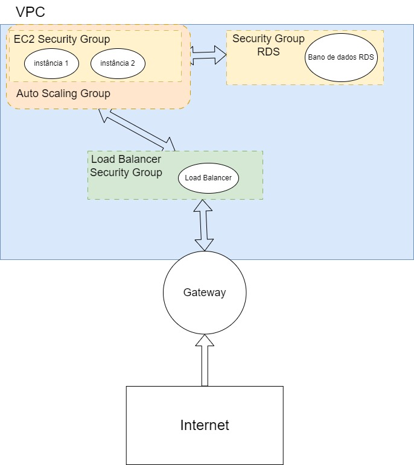

# Projeto-cloud

## Lincoln Rodrigo

### Descrição do Projeto

Deploy de forma automatizada utilizando o terraform. 
A infraestrutura é composta por
* VPC
* subnets (Foram criadas de forma privada para conectar as intâncias com o load balancer e apenas as instâncias acessam o banco de dados RDS)
* internet gateway ( Permitir o tráfego com a internet)
* instâncias ec2
* Load Balancer
* Auto Scaling
* Banco de Dados RDS
* S3 Bucket
* CloudWatch

O Load Balancer funciona distribuindo de forma equilibrada as requisições feitas na aplicação entre as instâncias EC2, estas que se comunicam com bando de dados RDS.

A política de auto scaling funciona para, caso as instâncias cheguem na condição configurada, geralmente para considerar um estresse nas duas instâncias, ele sobe mais instâncias para lidar com a alta do tráfego.

As instâncias EC2 estão com a aplicação para gerenciamento de academia feita na matéria **Megadados**, que é uma API  conectada com um banco de dados, nesse caso ao banco de dados RDS. A aplicação está neste [`Repositório`](https://github.com/LinkolnR/ApiRestFull-borafit)

Todas as permissões e regras de conexão estão sendo feitas através de security groups.

## Tutorial para utilização do terraform

### Requisitos:
*   Terraform, caso não tenha siga o seguinte [**Tutorial**](https://developer.hashicorp.com/terraform/tutorials/aws-get-started/install-cli)
* AWS CLI, caso não tenha siga o [**Tutorial**](https://docs.aws.amazon.com/cli/latest/userguide/getting-started-install.html)

Após a instalação do Terraform e do AWS CLI, configure as credenciais utilizando o:
```
aws configure
```
Depois de configurar as credenciais, vamos para os parâmetros do terraform, primeiramente precisamos gerar uma chave para ser utilizada dentro da aws: 
```
ssh-keygen -t rsa -b 4096 -m pem -f chave_de_exemplo.key
```
Após o comando acima, ele vai gerar dois arquivos `chave_de_exemplo` (lembre de colocar esse arquivo no .gitignore!!) e `chave_de_exemplo.pub`. Agora vamos atualizar o arquivo `variables.tf`:
``` python
variable "key_name"{
  description = "key para utilizar para conexão com instâncias"
  type        = string 
  default = "proj_link" <---# Edite Aqui para o nome da sua chave gerada
}
```
No arquivo `main.tf`, podemos configurar o backend do S3:
```py
    backend "s3" {
    bucket = "lincolnrpm-bucket" # edite aqui o nome do seu bucket
    key   = "terraform/terraform.tfstate" # caminho para onde vai salvar
    region = "us-east-1" 
    encrypt        = true
  }

```
**Importante lembrar que você dece criar o `bucket s3` antes de rodar o terraform e colocar o nome com o qual vc criou na linha `bucket`.**

Agora , vamos criar um arquivo `secrets.tfvars` para definição de dados sensíveis, no nosso caso, as credenciais de banco de dados, então siga o exemplo do arquivo `secrets.tfvars.example`:
```py
db_username = "admin" # altere para seu user
db_password = "sua_senha_secreta" # altere para sua senha
```
Feitas as devidas configurações vamos agora para rodar o terraform:
```
terraform init
```
Para subir a infraestrutura:
```
terraform apply -var-file="secrets.tfvars" -auto-approve
```
Para destruir a infraestrutura:
```
terraform destroy -var-file="secrets.tfvars" -auto-approve
```

## Desenho da infraestrutura resultante do código do terraform



### Detalhando um pouco mais sobre o diagrama

* RDS
  * Presente em um Security Group apenas para o RDS 
  * Responsável pelo Banco de Dados da API

* EC2
  * Presente no Security Group para as instâncias EC2, que permite comunicação com o RDS
  * Estão presentes no Auto Scaling Group, para criar novas instâncias com a demanda
  * Responsável pela aplicação, servidor da API

* Load Balancer
  * Em um Security Group que se comunica com as instâncias
  * Responsável por balancear o tráfego entre as instâncias evitando com que uma fica sobrecarregada
  * Em contato com o gateway, recebendo as requisições de fora


## Calculando os custos, as informações também estão presentes no arquivo 

### 1. Instância EC2:
* Região escolhida: us-east-1 (melhor custo benefício)
* Custos mensais: 12.70 USD
* Configurações
  * Tipo da instância: t2.micro
  * Opção de pagamento: Computer Savings Plan. Reservando por 3 anos sem pagamento adiantado
  * Considerando 3 instância (uma carga média de requisição)
  * Sistema : Linux

### 2. Amazon Private Cloud (VPC):
* Região escolhida: us-east-1 (melhor custo benefício)
* Custos mensais: 15.21 USD
* Configurações
  * Site-to-Site VPN: 1 conexão
  * Duração média : 10h/dia 

### 3. Load Balancer
* Região escolhida: us-east-1 (melhor custo benefício)
* Custos mensais: 19.35 USD
* Configurações
  * Número de Application Load Balancer: 1
  * Bytes processados: 0.5 GB/h
  * Média de novas conexões: 10/min

### 4. Amazon Simple Storage
* Região escolhida: us-east-1 (melhor custo benefício)
* Custos mensais: 0.02 USD
* Configurações:
  * tráfego de 1G/mês

### 5. Amazon RDS for MYSQL
* Região escolhida: us-east-1 (melhor custo benefício)
* Custos mensais: 53.62 USD
* Configurações:
  * tipo da instância: db.t2.micro
  * implantação: Multi-AZ
  * OnDemand
  * espaço: 30GB

### 6. Amazon CloudWatch
* Região escolhida: us-east-1 (melhor custo benefício)
* Custos mensais: 0.6 USD
* Configurações:
  * 2 métricas


O custo realizado acima foi feito no dia `4/12/2023` e para mais detalhes olhar o arquivo `Estimativa de custo.pdf`.